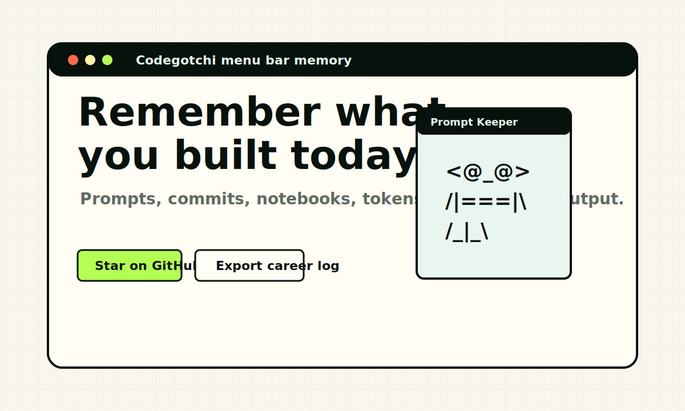

# Codegotchi

An ASCII menu bar companion that remembers what you built today.

Codegotchi is a macOS status bar prototype for developers who live inside prompts, notebooks, terminals, and GitHub. It turns opted-in local work signals into a tiny ASCII companion, daily work memory, weekly ranking, and portfolio-ready summaries.



## Features

- ASCII evolution stages powered by developer activity
- Menu bar prototype powered by Electron
- Local Electron telemetry for commits, notebooks, memory, prompt-log token estimates, and streaks
- Daily memory feed that turns work into a readable story
- Portfolio draft output from the day's coding context
- Weekly leaderboard mockup for GitHub-friendly ranking
- GitHub Pages friendly Vite setup
- English-first UI and README for public launch

## Quick start

```bash
npm install
npm run dev
```

Run the macOS menu bar prototype:

```bash
npm run app:dev
```

In Electron mode, Codegotchi scans this Mac for local-only activity metadata:

- git commits from local repositories
- `.ipynb` files touched today
- memory currently in use
- `.codex` and `.claude` prompt log file counts and token estimates

Raw prompt text is not uploaded anywhere. The public GitHub Pages build stays in simulated demo mode because browsers cannot read local machine data.

Build for production:

```bash
npm run build
```

## GitHub Pages deployment

This repo includes a GitHub Actions workflow at `.github/workflows/deploy.yml`.

1. Push the project to GitHub.
2. Open `Settings -> Pages`.
3. Set `Source` to `GitHub Actions`.
4. Push to `main`.

The workflow builds with `BASE_PATH="/<repo-name>/"`, so the Vite app works when hosted under a GitHub Pages project path.

## Real telemetry roadmap

- GitHub OAuth for commits, pull requests, reviews, and contribution streaks
- Local opt-in collectors for prompt logs, notebook runs, memory peaks, build time, and token usage
- Private local memory with explicit export controls
- Supabase or Firebase for real-time rankings
- Shareable profile cards for README badges and social posts

## Tech stack

- React
- TypeScript
- Vite
- Electron
- Lucide icons

## License

MIT
